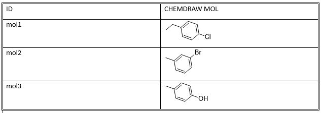

# ChemDraw cdx File To MS Word Table
Convert SDF to cdx format and insert ChemDraw Object in a Microsoft Word ( docx ) Table

This issue arises yearly for our Chemists as they write patents every year. They want to import the structure as a chemdraw object in the orientation that it was registered in.  Many tools including the ChemDraw for Excel plugin have issues.  Either they cannot import a structure or if they do, it's essentially a served object.  For example, our chemist converted SMILES to structure with the ChemDraw addin so it didn't match registration but when extracted from Excel, it was not actually and OLEObject in the cell when saved.  It was linked to the ChemDraw addin which activated upon opneing.  When Transfered to Word from Excel, it was an emf object which is simply an image format. JChem addin for Excel performed similarly, though no image tranferred to Word.  Not finding any solutions on the web, I explored this problem learning the VBA through Win32 tools to investigate the structure of the desired object.  There I extracted the information needed to insert ChemDraw as an OLEObject.

I've provided a minimized example solution on how to accomplish it so that you can modify it to your needs.

#### Requirements
1. ChemDraw executable and license.
2. Microsoft Word and license.

### How To
1. This implementation assumes that the files are in `C:/workingDir/`.  Change this `dirPath` variable to match the folder that you’re running it in.
   - Absolute path is required.  Relative paths fail.
3. Make sure the sub folders are in place or change code appropriately: `sdf`, `cdx`, `word`
4. Populate the sdf folder with desired named files with single structures with the filename as the ID.
   - I did this by adding a DB call to get the structures from our registration DB from the list in an Word Table
5. Open a terminal in the working directory and excecute: `python .\cdx_to_Word_Table.py`

###### Output Table in Microsoft Word Docx with ChemDraw OLEObjects as the Molecule

In memory file maniuplation failed for me and required actual files to to be generated.  If hard drive space is a premium, this could be done sequentially by saving the CTAB information in a table and processing each one at a time as a `temp.sdf` to `temp.cdx`.  In this case, the sdf to cdx function would be modified to process as a single file and then run the `dataframe.apply( lambda x: sdfToCDX( table, x.ID, x.rowID, colID )  )` as an example.

